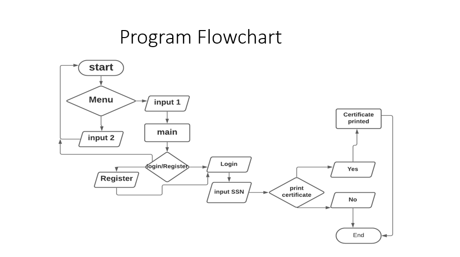

# Software development project
The German Federal Ministery of Health is planning to introduce a digital vaccination certificate. The aim is to develop an app for interoperable and standardised proof of vaccination for medical purposes. Identify a possible application solution. Code the basic functionalities of this software application in python, like data processing. Please also be aware of using classes. 

## Images

- lecture by Thomas Spittler
